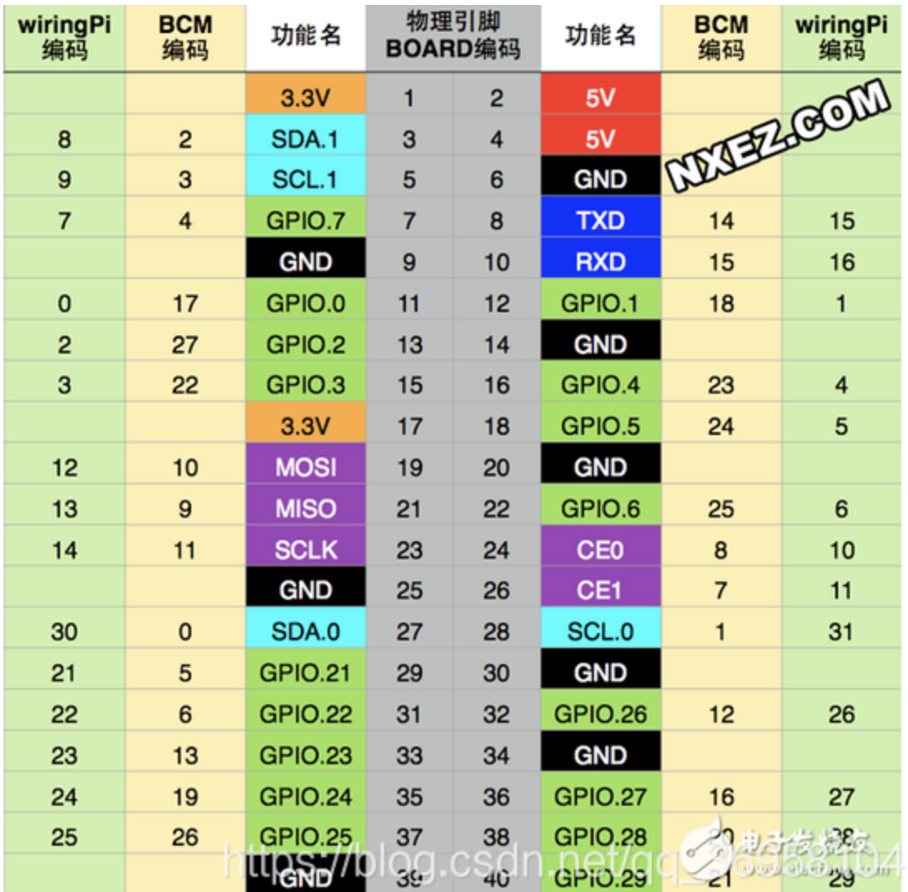
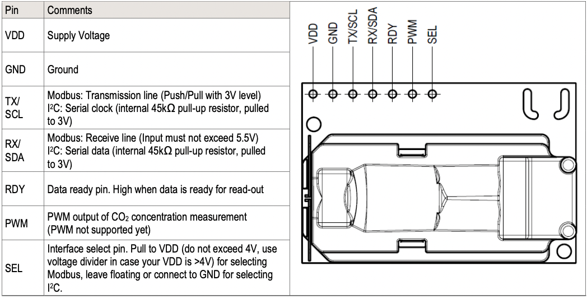

# 🚀

This is a client for sending sensor data


# How to run

## Step 1

> Wiring SCD-30 to Raspberry Pi 3B

The Raspberry Pi 3B 40-pin GPIO Layout is as following:



The Sensirion SCD-30 Sensor Pin-out is as following:



Wiring

| SCD-30  | Raspberry Pi 3B |
| :-----: | :-------------: |
| VDD/VIN |  3.3V (Pin#01)  |
|   GND   |  GND (Pin#09)   |
| TX/SCL  | GPIO03(Pin#05)  |
| RX/SDA  | GPIO02 (Pin#03) |

## Step 2

> Enabling I2C Interface on Raspberry Pi 3B
>
> There are some methods for you to enable I2C interface, I will introduce one of them.

First click on **<u>*Raspberry Pi Configuration*</u>** and then select <u>***I2C***</u> from <u>***Interfaces***</u>


## Step 3

> Installing related Python Libraries on Raspberry Pi 3B

Turn on the Raspberry PI 3B terminal , enter the following command

```bash
# install pip3 in your Raspberry Pi 4B
sudo apt install python3 -pip
# use scd30_i2c Library to read out Sensirion SCD-30 Sensor values.
pip3 install scd30_i2c
# for communication
pip install websockets
```

## Step 4

1. Open  <u>***webClient.py***</u>  file and change the IP address to your server's IP address
2. ==Please run <u>*webClient.py*</u> in Raspberry PI 3B==